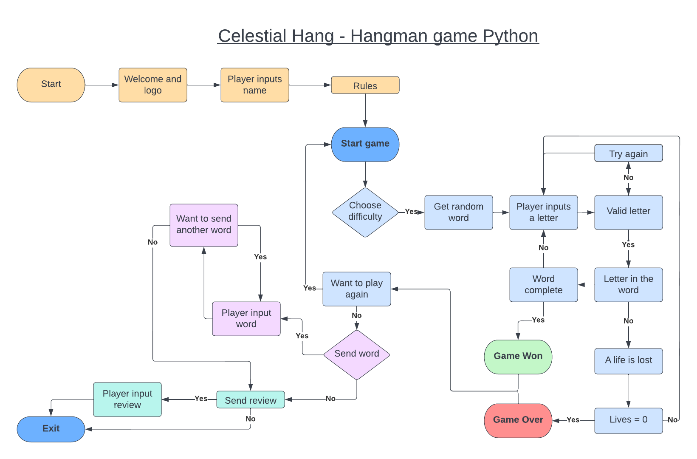

# CelestialHang

It is time to see if you can guess the right answer before the person gets hanged? Do you have what it takes? The theme for this is celestial so anything space related, look up into the sky and find the words hidden amoung the stars. Just like the classic hangman game, you guess the worng letter and lose a life, until it is to late and you are game over. Guess the right letter and you might just have won the game!

It is a game for all ages, alone as a family or a group. A fun guessing game to use a bit of time. So why don't you go ahead and see if you can save the day or maybe you can find the hidden level hidden in your score.

## __User Stories__

- ### As a player

    - I want to be able to play the hangman game.
    - I want to be able to understand the game without much help.
    - I will be told if I write invalid characters.
    - I can send in my own words to review.
    - I will be able to send in a review of the game.

## __Design__

### __Features__

- ### Navigation Bar

### __Color__

### __FlowChart__

- For visual aid to see what the game had to go through for it to work, I made this flowchart to go through each step for the basic ideas. The flowchart was created with [Lucid](https://lucid.app/documents#/dashboard).

## Technology

### Technologies Used

   - I have only used Python

### Programs Used

## __Testing__

### Fixed bugs

__Full testing__

## __Deployment__

## __Credits__

### Code Used

### Content 

### Honourable mentions