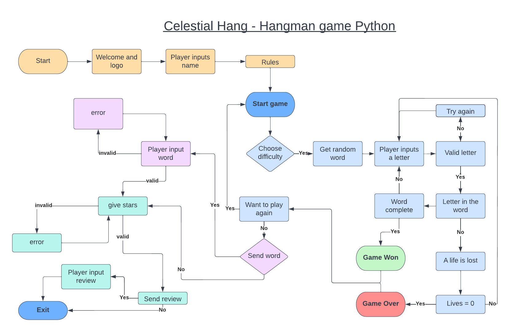
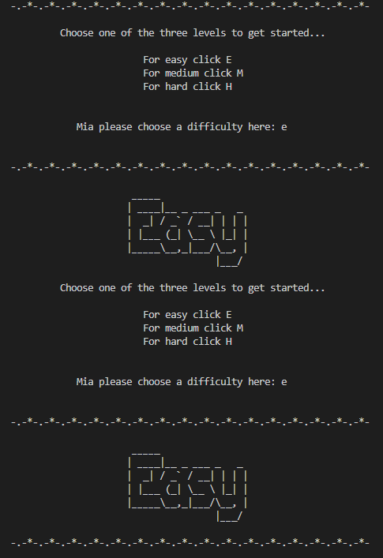
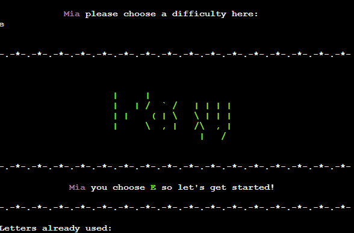
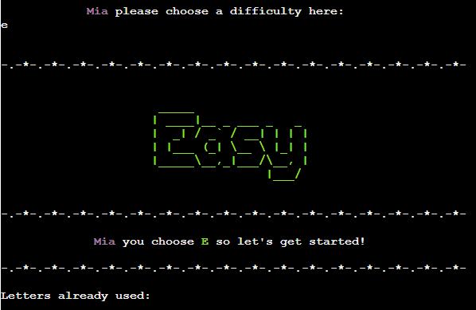

# CelestialHang

It is time to see if you can guess the right answer before the person gets hanged? Do you have what it takes? The theme for this is celestial so anything space related, look up into the sky and find the words hidden amoung the stars. Just like the classic hangman game, you guess the worng letter and lose a life, until it is to late and you are game over. Guess the right letter and you might just have won the game!

It is a game for all ages, alone as a family or a group. A fun guessing game to use a bit of time. So why don't you go ahead and see if you can save the day or maybe you can find the hidden level hidden in your score.

## __User Stories__

- ### As a player

    - I want to be able to play the hangman game.
    - I want to be able to understand the game without much help.
    - I will be told if I write invalid characters.
    - I can send in my own words to review.
    - I will be able to send in a review of the game.

## __Design__

### __Features__

- ### Navigation Bar

### Future Features

  - A fun future feature could be a leader board that show top 20
  - Point system that changes by each difficulty and how quick you can do it. So points would be based on how many lifes you had left in that round.
  - Multiplayer system. Where on one device multiplayer can be choosen and then 2 people can play against each other on guessing the most letters and losing the fewest lives. You could also play againt the computer.

### __Color__

  - Colors used in the game was a part of a library already in python program: colorama.

### __FlowChart__

- For visual aid to see what the game had to go through for it to work, I made this flowchart to go through each step for the basic ideas. The flowchart was created with [Lucid](https://lucid.app/documents#/dashboard).

## Technology

### Technologies Used

  - I have only used Python

### Programs Used
  - Git - Was used for version control, the Gitpod terminal to commit and push to GitHub.

  - [GitHub](https://github.com/) - Was used to store the project code

  - [Am I Responsive?](https://ui.dev/amiresponsive?) - Was used for having an image of the website on all sizes.

  - [Shields](https://shields.io/) - Was used to add different shields into the README. 

  - [Lucid](https://lucid.app/documents#/dashboard) -  Was used to create the flowchart.

  - [Heroku](https://www.heroku.com) - Was used to deploy the game.

  - [Ascii Art](https://ascii.mastervb.net/) - Was used for help on designing the ascii letters and numbers used.

## __Testing__

### Fixed bugs
  - One of my bugs where the fact that when choosing the difficulty level you would have it twice.
  
  This was fixed by fixing position of the game function to be above the level_difficulty fuction and not under it as well as deleting the main call on the level_difficulty fuction sinde the game. Because it was being called on the second time at the top of the game function.

  - My computer had problems after the deplyment to Heruko. All the underscores would disapear at random times and not come back. This was fixed not in the code but on my computer.
  
  

__Full testing__

## Improvements

  - The Easy level can sometimes be a lot harder then the Hard level. Lives amount might have to be switched around.

  - This game is not at all responsive, but can be played on all screens. It however, can be a bit hard to play on phones. This was however a backeend only created game so functionality was the main object for the game.

## __Deployment__

  - __via gitpod__
    - Log into GitHub.
    - Make a repository
    - Click the green button close to the top of the page that says Gitpod.
    - After letting Gitpod load an alert pops up on the top of the screen, click cancel.
    - Then click the button that says More Actions.
    - Hereafter click Open in Browser.
    - Now right click with your mouse over the big box on the left that has your repository name over it.
    - Click new file.
    - Then make an index.html file. 
    - Go to the top of the index file and click ! and enter. This will make a start template.
    - Make a basic structure for your index page.
    - Click on terminal at the bottom of the page.
    - write 'git add .'
    - Then for your first commit write 'git commit -m "Initial commit".
    - Hereafter write 'git push'.
    - Your code have now been pushed back and saved on your GitHub repository.

  - __Deployment to Heroku__
    - First log into your Heroku page on [Heroku website](https://www.heroku.com)
    - When on your dashboard click "new" and the click "create new app".
    - Now give you app a name make sure it is availble and then choose a region.
    - Click the "create app" button.
    - Go first to the "settings page".
    - If you are using a creds.js file then you will need to follow the next 4 steps.
      - Scrool down and find the button that says "reveal config vars" and click it.
      - Then write "CREDS" inside the box that says "KEY".
      - With you github open find the creds.js file and copy past the whole thing .into the box beside "KEY" that says "VALUE".
      - Now click the "add" button.
    - Scroll down bit more to find buildpacks.
    - Click on button that says "add buildpack".
    - Then click "python" and then click "save changes" button.
    - Repeat the last two steps but change the python buildpack out with nodejs.
    - Now cLick the "deploy page".
    - Click connct to Github in the deployment method.
    - Then you serch in your repository for the one you need. DO make sure the name is exactly the same.
    - Click the button "serch" and then click "connect"
    - Choose between automatic deployment or manual.
    - If manual was choosen wait for it to finish.
    - Now click the button "view"

## __Credits__

## Credits

### Code Used
- For general background knowledge on how to code the guessing part of the hangman gamme I used the [YouTube tutorial](https://www.youtube.com/watch?v=cJJTnI22IF8&t=2s&ab_channel=KylieYing) by Kylie Ying.

- Most of the graphics for the writing was made using [this software](https://ascii.mastervb.net/).

- I imported some libraries that are already a part of the Python program: time, random, string, colorama, re and gspread for the google spreadsheet.

- I also used the [Code Institute Python template](https://github.com/Code-Institute-Org/python-essentials-template) for this project.

### Content 
- No words I used in this game is my own.

- However, the art in itself was created by me.

### Honourable mentions
- Tutor Assistance Jason for doing his best at helping me figure out a bug that was happening after deplyment, but in the end was my computer that need to be updated.

- Tutor Assistance Ed for helping me find an error that had appeared that was causing input not to be send to google spreadsheet in my sendword file.

- Tutor Assistance Gemma for trying to help me make spaces inside the word the player is guessing if it is multiple words.

- [Bogdan/Bogdan_5P](https://github.com/Bogdan933) for taking his time to test out the game.

- [Tom/Tom F](https://github.com/TuckerFaulk) for taking his time to test out the game.

- [Daniel Harder](https://github.com/danio86) for taking his time to test out the game.

- [Rashidat/Rashidat_5P](https://github.com/https://github.com/shida18719) for taking her time to test out the game.